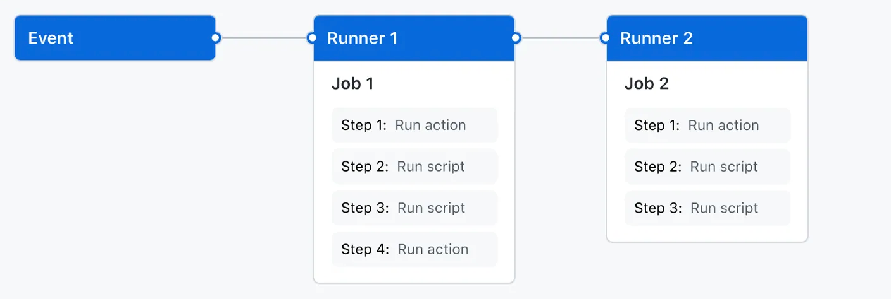

# Github Actions CI/CD 

- GitHub Actions is a continuous integration and continuous delivery (CI/CD) platform that allows you to automate your build, test, and deployment pipeline using workflows defined in YAML files.
- Workflows are defined in `.github/workflows/` directory of your repository.
- Each workflow consists of one or more jobs that run in parallel or sequentially.
- Jobs are made up of steps that can run commands or use actions.
- Actions are reusable units of code that can be shared and used across multiple workflows.

## Basic Concepts

- **Deployment**: GitHub Actions supports various deployment strategies, including blue-green deployments, canary releases, and rolling updates, allowing for safer and more controlled deployments.
- **Matrix Builds**: You can define a matrix of different configurations (e.g., operating systems, language versions) to run your tests across multiple environments in parallel, ensuring compatibility and reliability.
- **Scheduled Workflows**: You can set up workflows to run on a specific schedule using cron syntax, allowing for regular maintenance tasks or periodic checks.
- **Dependency Management**: You can cache dependencies to speed up workflow execution and reduce build times, improving overall efficiency.
- **Job Artifacts**: You can upload and download artifacts between jobs, allowing for better organization and sharing of build outputs.
- **Third-Party Integrations**: You can integrate with various third-party services, such as Docker Hub, AWS, and Azure, to enhance your CI/CD workflows and streamline your development processes.

## Components of a GitHub Actions

#### **Workflow**
The overall definition of the CI/CD process, defined in a YAML file. And Triggered by specific events or manually.
**Example Performance:**
- Building and testing pull requests
- Deploying your application every time a release is created
- Adding a label whenever a new issue is opened
(Writing Workflow)[https://docs.github.com/en/actions/how-tos/write-workflows]

#### **Event**
The specific activity that triggers the workflow. Events can be triggered by GitHub activities (like `push`, `pull_request`, etc.) or scheduled events (like `cron`).

(Event Triggers)[http://docs.github.com/en/actions/reference/workflows-and-actions/events-that-trigger-workflows]

#### **Job**
A set of steps that execute on the same runner. Jobs can run in parallel or sequentially, and you can define dependencies between jobs. You can also use a **matrix** to run the same job multiple times, each with a different combination of variables—like operating systems or language versions. 

#### **Action**
A reusable unit of code that can be shared and used across multiple workflows. Actions can be created by you or the community and can be found in the GitHub Marketplace.

#### **Runner**
A server that runs your workflows when they are triggered. GitHub provides hosted runners for various operating systems, or you can self-host your own runners.

#### **Step**
An individual task that can run commands or use actions. Steps are executed in the order they are defined within a job. Each step can either run a script or invoke an action.  

---
# Continuous Integration (CI)
- Continuous Integration (CI) is a software development practice where developers frequently integrate their code changes into a shared repository. Each integration is automatically verified by running tests and builds to detect errors early in the development process.
- When you commit code to your repository, you can continuously build and test the code to make sure that the commit doesn't introduce errors.
- Your tests can include code linters (which check style formatting), security checks, code coverage, functional tests, and other custom checks.
- CI helps to improve code quality, reduce integration issues, and accelerate the development process by providing rapid feedback on code changes.
- CI needs a server to run the builds and tests. GitHub Actions provides hosted runners that can be used for this purpose.

---
# Continuous Delivery (CD)
- Continuous Delivery (CD) is a software development practice where code changes are automatically deployed to a staging or production environment after passing through the CI process.
- CD ensures that your code is always in a deployable state, allowing for faster and more reliable releases.
- When your code passes all the tests and checks in the CI process, you can automatically deploy it to a staging environment or even to production.
- CD can be implemented in GitHub Actions by defining deployment jobs in your workflow that run after the CI jobs.

---
# Workflows
- One or more events that will trigger the workflow.
- One or more jobs, each of which will execute on a runner machine and run a series of one or more steps.
- Each step can either run a script that you define or run an action, which is a reusable extension that can simplify your workflows.

## Steps occurs to trigger a workflow (GitHub Actions)
1. An event occurs in your repository (like a push or pull request). The event has an associated commit SHA and Git ref.
2. GitHub searches the .github/workflows directory in the root of your repository for workflow files that are present in the associated commit SHA or Git ref of the event.
3. A workflow run is triggered for any workflows that have on: values that match the triggering event. Some events also require the workflow file to be present on the default branch of the repository in order to run.

(Starter Workflow)[https://github.com/actions/starter-workflows/tree/main/deployments]
(Workflow Syntax for GitHub Actions)[https://docs.github.com/en/actions/reference/workflows-and-actions/workflow-syntax#about-yaml-syntax-for-workflows]

## YAML Syntax

- Either `.yml` or `.yaml` file extension.
- Stored in the `.github/workflows/` directory of your repository.
- Consists of:
  - `name`: (Optional) The name of the workflow.
  - `on`: The event(s) that trigger the workflow.
  - `jobs`: A collection of jobs to be run as part of the workflow. 

(Complete Syntax)[https://docs.github.com/en/actions/reference/workflows-and-actions/workflow-syntax#onevent_nametypes]

