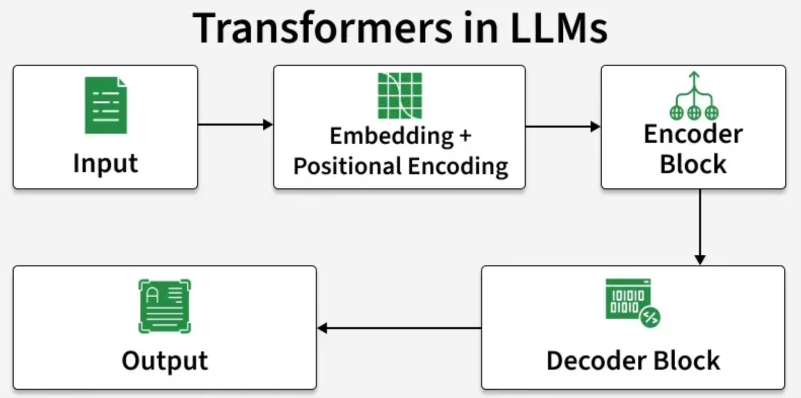
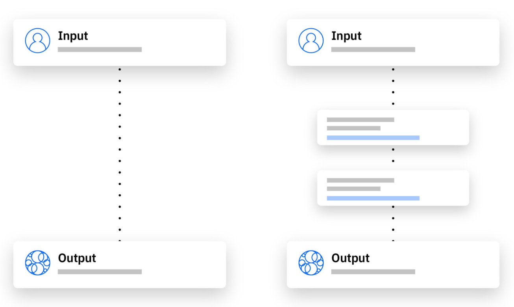

# Large Language Model (LLM)

- Large Language Models (LLMs) are advanced AI systems built on deep neural networks designed to process, understand and generate human-like text.
- By using massive datasets and billions of parameters, LLMs have transformed the way humans interact with technology.
- It learns patterns, grammar and context from text and can answer questions, write content, translate languages and many more.
- Modern LLMs include ChatGPT (OpenAI), Google Gemini, Anthropic Claude, etc.

[LLM Tutorial](https://www.geeksforgeeks.org/deep-learning/large-language-model-llm-tutorial/)

### Working of LLM

LLMs are primarily based on the Transformer architecture which enables them to learn long-range dependencies and contextual meaning in text.

- **Input Embeddings:** Converting text into numerical vectors.
- **Positional Encoding:** Adding sequence/order information.
- **Self-Attention:** Understanding relationships between words in context.
- **Feed-Forward Layers:** Capturing complex patterns.
- **Decoding:** Generating responses step-by-step.
- **Multi-Head Attention:** Parallel reasoning over multiple relationships.

[Architecture and Working of Transformers in DL](https://www.geeksforgeeks.org/deep-learning/architecture-and-working-of-transformers-in-deep-learning/)

### Architecture

- Embedding Layer
- Attention Mechanism
- Feed-Forward Layers
- Normalization and Residual Connections
- Output Layer

[LLM Architecture](https://www.geeksforgeeks.org/artificial-intelligence/exploring-the-technical-architecture-behind-large-language-models/)

### Examples

- GPT-4, GPT-4o(OpenAI)
- Gemini 1.5(Google DeepMind)
- Claude 3 (Anthropic)

### Use Cases

Code Generation, Debugging and Documentation, Question Answering, Language Translation and Correction, Prompt-Based Versatility

### Limitations

- Hallucinations
- Limited Reasoning Skill
- Bias
- Limited Long-Term Memory
- Limited Knowledge
- Prompt Hacking

---

# Vector Embeddings

- It is numerical representation of data points that express different types of data, including nonmathematical data such as words or images, as an array of numbers that machine learning (ML) models can process. The data is embedded in n-dimensional space.
- A vector embedding transforms a data point, such as a word, sentence or image, into an n-dimensional array of numbers representing that data point’s characteristics—its features. This is achieved by training an embedding model on a large data set relevant to the task at hand or by using a pretrained model.

### Types of Embeddings

- Text embeddings
- Audio embeddings
- Product embeddings
- Graph embeddings

### Types of text embeddings

- Word embeddings
- Sentence embeddings
- Document embeddings

### Vector databases

A vector database stores and indexes data as high-dimensional vectors, which are numerical representations of complex data like text, images, and audio. Unlike traditional databases that rely on exact keyword matches, vector databases use similarity searches(**Vector Search**) to find data that is conceptually similar, even if it's not an exact match.

[Embeddings Code](https://platform.openai.com/docs/guides/embeddings#what-are-embeddings)

#### Faiss (Facebook AI Similarity Search)

- Faiss is a library, vector database for efficient similarity search and clustering of dense vectors.
- When you embed your documents into vectors (like [0.12, 0.56, -0.22, ...]), FAISS helps you store, index, and search through millions of those embeddings in milliseconds.
- Features - Fast, Runs on local(no cloud cost), easy integration(with LangChain, HuggingFace, LlamaIndex), Accuracy and Privacy
  **Steps:**
- Installation -> `pip install faiss-cpu or faiss-gpu`
- Load your embeddings & documents
- Pick appropriate index type
- Add vectors & metadata
- Perform search / retrieval
- Integrate with your RAG chain
- Monitor & optimize

#### ChromaDB

- Installation -> `pip install chromadb`
- Create a Chroma Client
- Create a collection
- Add some text documents to the collection
- Query the collection
- Inspect Results

---

# Methods to generate AI outputs

- RAG
- Prompt Engineering
- Fine-turing
- Pre-training

---

# RAG(Retrieval augmented generation)

- Retriever + Generator
- RAG is an LLM optimization method, data architecture framework that connects an LLM to an organization’s proprietary data, often stored in data lakehouses. These vast data platforms are dynamic and contain all the data moving through the organization across all touchpoints, both internal and external.
- It combines a knowledge base with a LLM.

[RAG using Langchain](https://python.langchain.com/docs/tutorials/rag/)

**Four Stage Process**

- Query
- Info Retrieval
- Integration
- Response

**What Problems does RAG solve?**
Hallucinations, Outdated Information, Contextual Relevance, Domain Specific Knowledge, Cost and Efficiency, Scalability across domains

### Fixing Hallucination with Knowledge Bases - Retrieval Augmentation

- The parametric knowledge refers to everything the LLM learned during training and acts as a frozen snapshot of the world for the LLM.
- The second type of knowledge is source knowledge. This knowledge covers any information fed into the LLM via the input prompt.

**Steps:**

1. Creating Knowledge Base
2. Getting Data for Knowledge Base
3. Creating Chunks -> Splitting our text into smaller chunks(To improve embedding accuracy, ability by reducing text fed)
   Using the tokenizer, we can create tokens from plain text and count the number of tokens.
4. Creating Embeddings
   The chunks of text in knowledge base is encoded into a vector embedding(Numerical Representations)
   `text-embedding-ada-002`
5. Vector Database
   A vector database is a type of knowledge base that allows us to scale the search of similar embeddings to billions of records, manage our knowledge base by adding, updating, or removing records, and even do things like filtering.
6. LangChain Vector Store and Querying

---

# Fine-Turing

Fine-tuning means training the model further on your own dataset so that it adapts to your domain, tone, or tasks.

### Types:

- Full fine-tuning: Update all weights (costly, rarely done).
- LoRA / Adapter fine-tuning: Add small, efficient trainable layers (popular).

### Full Fine-Tuning

You retrain all the parameters (weights) of the model using your new dataset. Supervised Learning

### Parameter-Efficient Fine-Tuning (PEFT)

Instead of updating all weights, you freeze most parameters and only train a small number of additional ones (like adapters or low-rank matrices).

---

# Prompt Engineering

[Documentation](https://learnprompting.org/docs/basics/introduction)
Prompt engineering is the process of crafting and refining prompts to improve the performance of generative AI models.

### Zero-Shot

- You give the model only the instruction or question, without any examples.
- The model relies purely on its pre-trained knowledge.
- Simple, Fast, Less Accuracy, No example

### Few-Shot

- You give the model a few input-output examples in the prompt before your actual query.
- This helps it infer the pattern or style you want.
- Pattern Learning, Flexible, High Accuracy

### Chain-of-thoughts

- You explicitly ask the model to “think step by step” to improve reasoning and problem-solving.
- This helps it break down complex logic instead of jumping straight to an answer.
- Logic, Math, Analysis, More Verbose

**Types**

- Zero-shot chain of thought
- Automatic chain of thought
- Multimodal chain of thought

---

# Integration into Apps

### Summarization

Summarization is the task of producing a shorter version of a document while preserving its important information. Some models can extract text from the original input, while other models can generate entirely new text.
Can be done with **_Transformers_**

### Sentiment Analysis

Sentiment analysis, or opinion mining, is the process of analyzing large volumes of text to determine whether it expresses a positive sentiment, a negative sentiment or a neutral sentiment.

**Types:**

- Fine-grained (graded)
- Aspect-based (ABSA)
- Emotion Analysis

---

# Security in AI

### Prompt Injection

- Prompt injection happens when user-crafted input manipulates or overrides your system’s intended behavior.
- Lead to harmful action, false output, broken logic in application.

**Jailbreaks** - Target model-level safety filters, while prompt injection targets your application’s behavior. It is bypassing LLM's Safety measures.

Prompt Injection can be;

- Direct -> in input prompt
- Indirect -> in documents attached while prompting

**Protections:**

- Product Design Patterns (Architecture) - prompting format, limited permissions
- Runtime Security - monitoring
- LLM testing and Red-Teaming

### AI Privacy

**Risks:**

- Collection of sensitive data
- Collection of data without consent
- Use of data without permission
- Unchecked surveillance and bias
- Data exfiltration
- Data leakage

### Access Control

Access Control is a method of limiting access to a system or resources.
**Components:**

- Authentication - 2FA, Multi-FA, Passwords, Token
- Authorization
- Access
- Manage
- Audit

**Types:**

- Role-based Access Control
- Identity-based Access Control
- Attribute-based Access Control
- Discretionary-based Access Control
- History-based Access Control
- Mandatory-based Access Control
- Organization-based Access Control
- Rule-based Access Control

### IAM (Identity and Access Management)

[AWS IAM](http://docs.aws.amazon.com/iam/)
