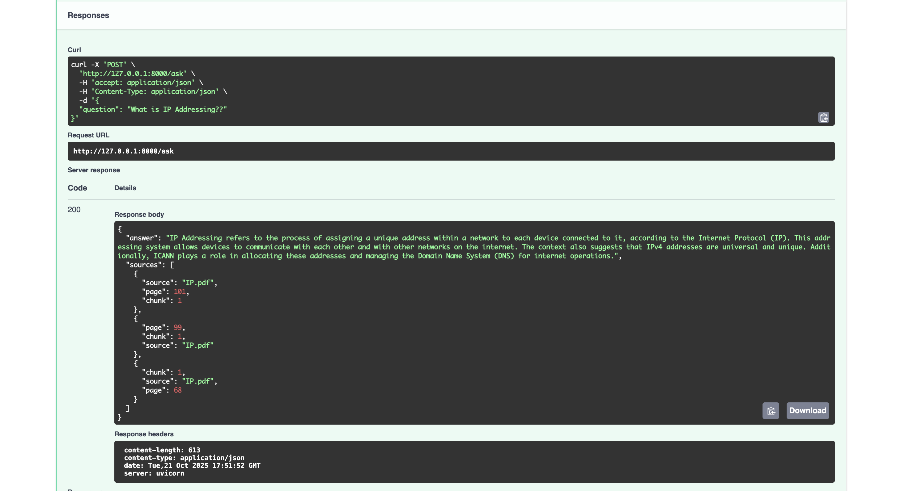

# Challenge 5 - RAG Project

## Project Overview

This project implements a Retrieval-Augmented Generation (RAG) system for answering questions based on PDF documents. The system combines;

1. **Vector database (Chroma DB)** for storing embeddings of document chunks.
2. **SentenceTransformer embeddings** for semantic similarity search.
3. **LLM (Ollama Mistral)** to generate answers constrained to retrieved document context.

Instead of asking a language model to answer freely, we first retrieve relevant chunks from PDFs and then feed them to the model. This ensures the answers are accurate and grounded in your documents.

## Features

- Ingest multiple PDF documents and split them into overlapping text chunks.
- Generate embeddings for chunks and store them in a persistent Chroma DB.
- Retrieve the top-3 relevant chunks based on user queries.
- Use Ollama LLM to generate contextual answers.
- Optional RAG evaluation using predefined Q/A pairs.
- REST API using FastAPI for querying from any client.

## Project Structure

```
project-root/
│
├── docs/
│   ├── IP.pdf
│   └── Routing.pdf
├── chroma_db/
├── ingest_and_index.py
├── query_rag.py
├── app.py
├── requirements.txt
└── README.md
```

## How it works?

Loading Documents -> Split into Pages -> Text Chunks -> Embeddings -> Chroma DB -> User Query -> Send Chunks -> Answer Generated

1. Document Ingestion
   Load PDFs using `PyPDFLoader`.
   Split text into small overlapping chunks using `RecursiveCharacterTextSplitter`.
   Add metadata: source filename, page number, chunk number.
2. Embedding
   Convert text chunks to embeddings using `SentenceTransformers`.
   Store embeddings + metadata in `Chroma DB` for fast semantic search.
3. Querying
   User inputs a question.
   Embed the question into the same vector space.
   Retrieve top-3 most similar chunks from Chroma DB.
4. Answer Generation
   Build a prompt with retrieved chunks as context.
   Send prompt to `Ollama Mistral LLM`.
   Receive context-aware answer constrained to your documents.
5. Output
   CLI prints the answer + retrieved chunks.
   API returns JSON with answer + sources.

## Ways to Query / Evaluate

1. Evaluate Sample Q/A Pairs
2. Interactive Query Loop - Using Prompt, Using top 3 Chunks of answer
3. API Query - POST /ask

## Setup Instructions & Testing

1. Create a virtual environment
   `python -m venv venv`
2. Activate the virtual environment
   `source venv/bin/activate`
3. Install Dependencies
   `pip install -r requirements.txt`
4. Ingest PDFs and build database
   `python ingest_and_index.py`
5. Query PDFs via CLI
   `python query_rag.py`
6. Enter your question(type `exit` to stop)
7. Run as FastAPI REST API
   `uvicorn app:app --reload`
8. Visit `http://127.0.0.1:8000/docs`
   POST /ask
   Request Body:
   {
   "question": "What is RIP Message Format?"
   }
   Example response:
   {
   "answer": "The type of message: request (1) and response (2).",
   "sources": [
   {"source": "Routing.pdf", "page": 2, "chunk": 1},
   {"source": "Routing.pdf", "page": 5, "chunk": 3}
   ]
   }



